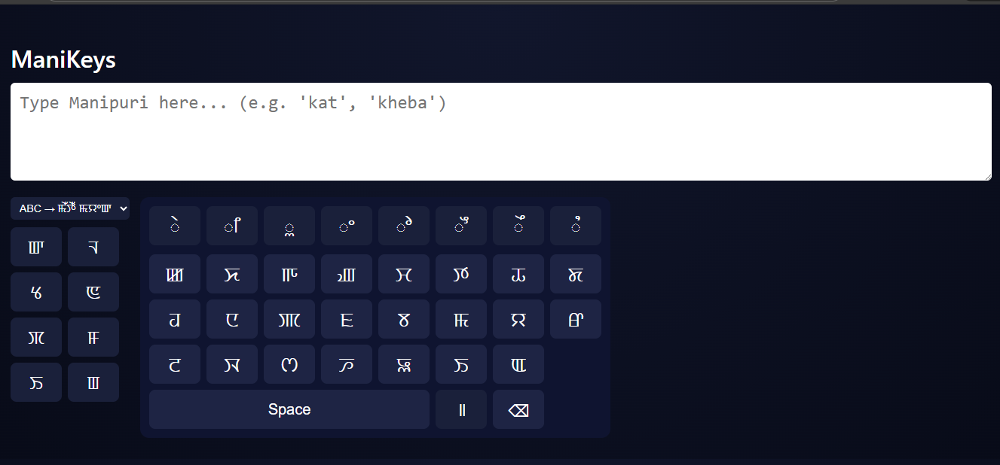

# ManiKeys


ManiKeys is a simple web-based tool that allows typing Manipuri (Meitei Mayek) using a normal English (ABC) keyboard through transliteration rules.

It runs entirely in the browser and requires no installation.

You can access it right now [Here](https://malemsana.github.io/manikeys)

---

## Features

* Type Manipuri using English letters
* Converts ABC input → Meitei Mayek
* On-screen Meitei Mayek keyboard
* Works offline after loading
* Lightweight (single HTML-based project)

---

## How It Works

ManiKeys uses basic mapping rules to approximate Manipuri characters from English input.

Example:

```
kat   → ꯀꯠ
kheba → ꯈꯦꯕꯥ
```

This is not a perfect linguistic model — it focuses on practical everyday typing.

---

## Usage

1. Open the HTML file in a browser
2. Start typing using English letters
3. The output appears in Manipuri (Meitei Mayek)

Optional: Use the on-screen keyboard to insert characters manually.

---

## Limitations

* Approximate transliteration, not 100% accurate
* No predictive text or spell checking
* No backend / database

---

## Why This Project

Manipuri typing tools are limited and often heavy.
ManiKeys aims to provide a lightweight, accessible option for basic Manipuri input using only a browser.

---

## License

MIT License

---
